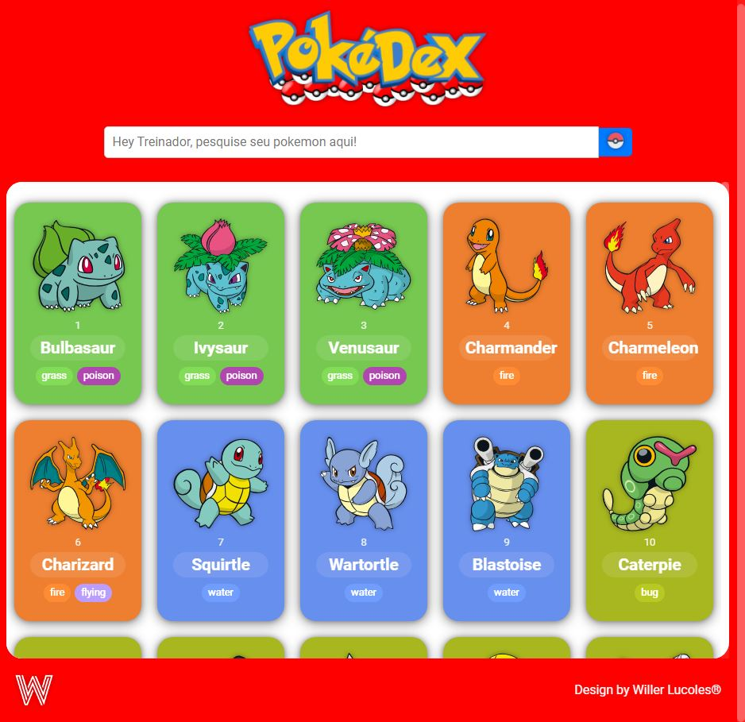

# Pokédex Simples

Um simples Pokédex desenvolvido em HTML, CSS e JS, utilizando a API PokeAPI para buscar informações sobre Pokémon e exibi-las em um modal.

## Tecnologias Utilizadas

- HTML
- CSS
- JavaScript

## Funcionalidades:

- Requisição à API: Utilização da API PokeAPI para obter informações detalhadas sobre os Pokémon através de requisições HTTP assíncronas.
- Manipulação do DOM: Aplicação de técnicas avançadas para dinamicamente atualizar o conteúdo da página com base nos dados recebidos da API.
- Promises: Implementação de Promises para lidar de forma eficiente com operações assíncronas e garantir um código mais limpo e legível.

## Preview

Deploy:

https://pokedex-nine-teal.vercel.app/

## Contribuição

Sinta-se à vontade para contribuir com melhorias, correções de bugs ou novas funcionalidades. Abra uma [issue](https://github.com/WillerLucoles/Pokedex/issues) ou envie um pull request.

## Licença

**Nota:** Este projeto é apenas para fins educacionais e de demonstração. Pokémon é uma marca registrada da Nintendo, Game Freak e Creatures Inc.
